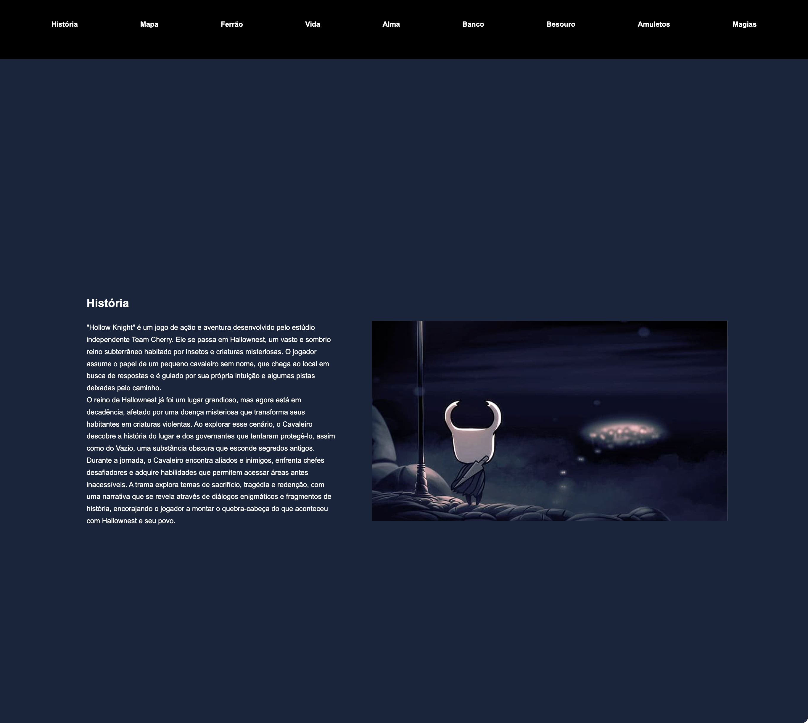

# Site Vertical

Gabriel Soares

---

## Sobre
Tabela de empresas com sua descrição
O objetivo deste projeto é colocar em prática os conhecimentos adquiridos sobre as linguagens de marcação , HTML, CSS e markdown, durante o curso Técnico em Desenvolvimento de Sistemas do [SENAI Jandira](https://sp.senai.br/unidade/jandira/).

---

## Tecnologias utilizadas
- HTML
- CSS
- Markdown
- git

---

## Autor
- [Gabriel Soares](https://www.linkedin.com/in/gabriel-soares-3098782b0/)
